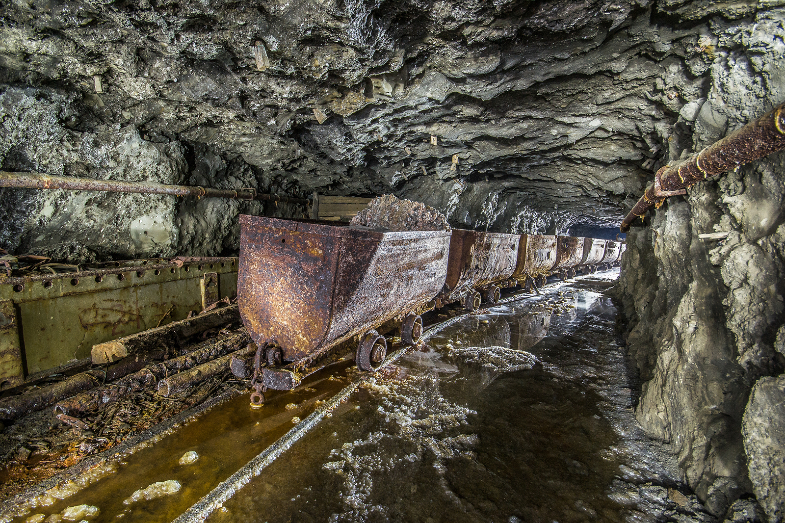

# Metal mining

It is difficult to imagine life without iron, aluminum, copper, zinc,
lead, gold, or silver. These and other metallic resources mined from
the Earth are vital building blocks of our civilization — and society’s
need for them is increasing. Metal mining in the United States has
evolved from small, simple operations to large, complex production and
processing systems. Some historic mining activities that occurred when
environmental consequences were poorly understood have left an unfortunate environmental legacy. Today, mining companies must plan for
and deal with environmental impacts before, during, and after mining.
Mineral deposits containing metals are mined from the surface in open
pit mines, or from underground. Later chapters describe the mining
process, which separates metals from the rocks and minerals in which
they occur, as well as potential environmental impacts and solutions.
Included in this chapter is basic information about metal mining: what
the environmental concerns are, how science and technology can help,
why metals are important, and the steps in the mining cycle.
What the Environmental Concerns Are
Operations and waste products associated with metal extraction and
processing are the principal causes of environmental concerns about
metal mining, which may
 Physically disturb landscapes as a result of mine workings, waste rock
and tailings disposal areas, and facility development.
 Increase the acidity of soils; such soils can be toxic to vegetation and
a source of metals released to the environment.
 Degrade surface and groundwater quality as a result of the oxidation
and dissolution of metal-bearing minerals.
 Increase air-borne dust and other emissions, such as sulfur dioxide
and nitrogen oxides from smelters, that could contaminate the
atmosphere and surrounding areas.
Modern mining operations actively strive to mitigate these potential
environmental consequences of extracting metals. The key to effective
mitigation lies in implementing scientific and technological advances
that prevent or control undesired environmental impacts.
How Science and Technology Can Help
As scientific and technological advances increase the understanding of
the physical and chemical processes that cause undesired environmental consequences, metal mines and related beneficiation or smelting
facilities apply this understanding to prevent and resolve environmental
problems. Ongoing mining operations and mine closure activities
employ several different mitigation approaches including
 Reclamation of disturbed lands,
 Treatments and stabilization of metal-bearing soils,
 Prevention and treatment of contaminated water,
 Controls on the amount and character of emissions to the atmosphere,
 Minimizing waste and recycling raw materials and byproducts.
Better, more cost-effective approaches are needed for dealing with the
environmental impacts of mining, beneficiation, and smelting, especially
measures that prevent undesired environmental impacts. Scientific and
technological research, focused on understanding the underlying
processes important to these problems, can provide the foundation for
new, cost-effective solutions. The challenge for future metal production
is to develop environmentally sound mining and processing techniques
that can also contribute to more widespread mitigation of historical
environmental problems.

